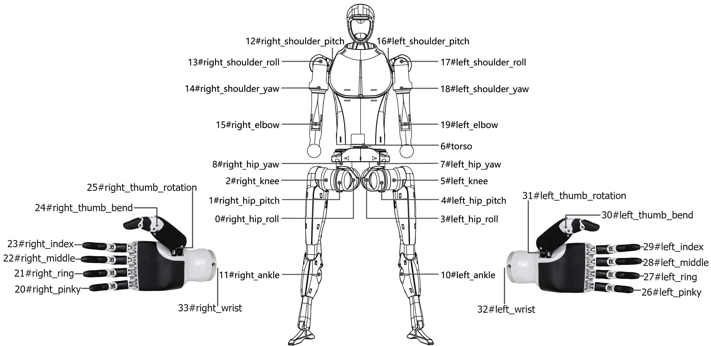
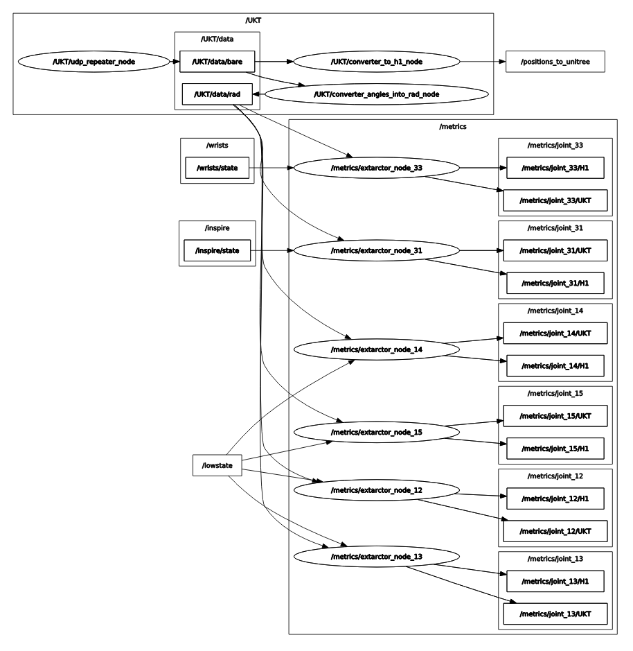

# unitree_h1_teleoperation_ws
В данном репозитории лежат ROS2-пакеты, необходимые для телеуправления роботом Unitree H1 с помощью Устройства Копирующего Типа (УКТ) от НПО "Андроидная техника".
Заметим, что данный репозиторий запускает только ноды, нужные для приёма значений от УКТ и их конвертации. Для запуска всей системы необходимо так же установить [meta_launch_ws](https://github.com/cyberbanana777/unitree_h1_meta_launch_ws?tab=readme-ov-file#-какие-репозитории-установить) и другие репозитории (см. [meta_launch_ws / какие репозитории установить](https://github.com/cyberbanana777/unitree_h1_meta_launch_ws?tab=readme-ov-file#-какие-репозитории-установить))

## Оглавление

1. [📦 Содержание репозитория](#-содержание-репозитория)
2. [🚀 Быстрый старт](#-быстрый-старт)
3. [⚙️ Предварительные требования](#️-предварительные-требования)
4. [🧪 Использование](#-использование)
   - 4.1 [Запуск узлов](#запуск-узлов)
   - 4.2 [Запуск Launch файлов](#запуск-launch-файлов)
5. [Кастомные библиотеки](#кастомные-библиотеки)
   - 5.1 [`ukt_library`](#ukt_library)
6. [📡 Интерфейс (топики, сервисы, действия, параметры)](#-интерфейс-топики-сервисы-действия-параметры)
   - 6.1 [Пакет 1: `converter_angles_ukt_into_rad_node`](#пакет-1-converter_angles_ukt_into_rad_node)
   - 6.2 [Пакет 2: `converter_angles_ukt_into_rad_node`](#пакет-2-converter_angles_ukt_into_rad_node)
   - 6.3 [Пакет 3: `extractor_package`](#пакет-3-extractor_package)
   - 6.4 [Пакет 4: `repeater_package`](#пакет-4-repeater_package)
7. [🗺️ Архитектура](#️-архитектура)
   - 7.1 [`teleoperation_launch`](#teleoperation_launch)
   - 7.2 [`teleoperation_with_metrics_launch`](#teleoperation_with_metrics_launch)
8. [Лицензия](#лицензия)
9. [Предложения и корректировки](#предложения-и-корректировки)

---

[//]: # (Далее следует основной контент README.md с существующими разделами)

## 📦 Содержание репозитория
* **`completed_scripts_teleoperation/`**: Содержит python launch-файлы, которые запускают конфигурации нод из данного репозитория для задач соответствующих названиям launch-файлов.
* **`converter_from_ukt_into_rad_package/`**: Содержит ноду, которая конвертирует значения, полученные с УКТ, в радианы.
*   **`converter_from_ukt_to_h1_package/`**: Содержит ноду, которая конвертирует значения, полученные с УКТ, в формат для управления Unitree H1 (для low_level_control_node).
*   **`debug_scripts/`**: Содержит отладочные скрипты, которые использовались при разработке данного ПО.
*   **`extractor_package/`**: Содержит ноду, которая  извлекает текущую угловую координату выбранного сустава с Unitree H1 и с УКТ одновременно и републикует полученные значения в отдельные ROS2-топики для построения графиков и т. п.
*   **`radon_reports/`**: Содержит отчёты о качестве кода. 
*   **`repeater_package/`**: Содержит ноду, которая ретранслирует данные с UDP-сокета в ROS2-топик 
*   **`ukt_library/`**: python3-библиотека, содержит часто используемые в этом репозитории функции, словари и структуры данных.
*   **`docs/`**: Дополнительная документация.
*   **`install_dependensies.bash`** - Bash-скрипт,  при запуске которого устанавливаются все необходимые python-зависимости через pip.
*   **`README.md`**: Этот файл.
*   **`save.bash`**: Скрипт для быстрой выгрузки на github
*   **`LICENSE`**: Лицензия, под которой распространяется данное программное обеспечение

<p align="right" style="margin-top: 20px;"><a href="#оглавление" style="text-decoration: none;">🔝 Вернуться к оглавлению</a></p>

## 🚀 Быстрый старт
Пошаговая инструкция для **быстрого** запуска основной функциональности. Предполагаем, что ROS2 (Foxy) уже установлен. 

1.  **Клонировать репозиторий** в `src` вашего workspace:
```bash
mkdir -p unitree_h1_teleoperation_ws/src
cd unitree_h1_teleoperation_ws/src
git clone https://github.com/cyberbanana777/unitree_h1_teleoperation_ws.git .
my_pwd=$(pwd)
```
2. **Установить проприетарные зависимости** (по ссылкам инструкции по установке от производителя): 
-   [unitree_sdk2py](https://github.com/unitreerobotics/unitree_sdk2_python/tree/master) - библиотека от производителя с инструкцией по установке. В оригинале она работает не очень хорошо, поэтому мы переработали её и сделали установку проще. Можно установить оригинал (ссылка выше) или наш вариант, который устанавливается вместе с [unitree_h1_control_ws](https://github.com/cyberbanana777/unitree_h1_control_ws), даже если вам не нужен функционал этого репозитория.
-   [unitree_ros2](https://github.com/unitreerobotics/unitree_ros2). Если вы уже установили данную зависимость при установке другого репозитория, повторно выполнять не нужно. По ссылке выполняете всё, что написано до `Connect to Unitree robot`. После всех действий нужно выполнить команду:
```bash
echo "source ~/unitree_ros2/cyclonedds_ws/install/setup.bash" >> ~/.bashrc
source ~/.bashrc 
```
3. **Установить pip-зависимости:**
Для простоты мы сделали bash-скрипт, который автоматизирует этот процесс. Его необходимо запустить. Для этого выполним команды:
```bash
cd $my_pwd
chmod +x install_dependensies.bash
./install_dependensies.bash
```
4.  **Собрать workspace:**
```bash
cd $my_pwd/..
colcon build # --symlink-install позволяет не colcon'ить область после изменений кода пакетов, что бы изменения были видны системе.
source install/setup.bash  # Или setup.zsh - в зависимости от вашего интерпретатора командной строки
```
5. Добавить `source` в `~/.bashrc`: 
Зачем? - Чтобы не делать при каждом перезапуске терминала `source install/setup.bash`. Выполните команды ниже и это изменит код `~/.bashrc` - скрипта, который выполняется при запуске нового терминала. Для каждой ws делается отдельно. 
```bash
line_to_add="source \"$(pwd)/install/setup.bash\""
grep -qxF "$line_to_add" ~/.bashrc || echo "$line_to_add" >> ~/.bashrc
```
6.  **Запустить пример / основной функционал:**
launch-файл, который запускает только ноды из этого репозитория (подробнее см. 🧪 Использование)
```bash
ros2 launch completed_scripts_teleoperation teleoperation_launch.py
```
или
```bash
ros2 launch completed_scripts_teleoperation teleoperation_with_metrics_launch.py
```
Launch-файлы, которые запускают всю систему целиком смотри в [unitree_h1_meta_launch_ws](https://github.com/cyberbanana777/unitree_h1_meta_launch_ws?tab=readme-ov-file#%D0%B7%D0%B0%D0%BF%D1%83%D1%81%D0%BA-launch-%D1%84%D0%B0%D0%B9%D0%BB%D0%BE%D0%B2)

<p align="right" style="margin-top: 20px;"><a href="#оглавление" style="text-decoration: none;">🔝 Вернуться к оглавлению</a></p>

## ⚙️ Предварительные требования

Что нужно для шагов "Быстрого Старта":
*   **Поддерживаемые версии ROS2:** Foxy
*   **Поддерживаемые платформы:** Ubuntu 20.04
*   **Ключевые ROS2 пакеты:** `rclpy`, `std_msgs`, `geometry_msgs`, `unitree_go`

<p align="right" style="margin-top: 20px;"><a href="#оглавление" style="text-decoration: none;">🔝 Вернуться к оглавлению</a></p>

## 🧪 Использование

Как пользоваться пакетами после установки и сборки.

### **Запуск узлов:**
#### **converter_angles_ukt_into_rad_node**
```bash 
ros2 run converter_angles_ukt_into_rad_package converter_angles_ukt_into_rad_node
```
#### **converter_from_ukt_to_h1_package**
```bash
ros2 run converter_from_ukt_to_h1_package converter_from_ukt_to_h1_node
```
#### **extractor_package**
##### Без параметра
```bash
ros2 run extractor_package extractor_node
```
##### С параметром
Параметр - это номер сустава H1, значение положения которого будет получено с робота и с соответсвующего ему сустава УКТ.
Значение по умолчанию 16 - left_shoulder_roll.
```bash
ros2 run extractor_package extractor_node --ros-args -p H1_joint_num:=15 # С параметром значения типа int
```
Нумерация суставов робота представлена ниже.

#### **repeater_package**
```bash
ros2 run repeater_package repeater_node 
```

<p align="right" style="margin-top: 20px;"><a href="#оглавление" style="text-decoration: none;">🔝 Вернуться к оглавлению</a></p>

### **Запуск Launch файлов:**
#### **Запуск основного функционала**
```bash
ros2 launch completed_scripts_teleoperation teleoperation_launch.py
```
**Запускаемые ноды** (в формате `пакет` -> `зависимость`):
- `repeater_package` -> `repeater_node`
- `converter_from_ukt_to_h1_package` -> `converter_from_ukt_to_h1_node`
#### **Запуск основного функционала с публикацией угловых положений выбранных суставов каждого в отдельный топик**.
Для выбора суставов, положения которых отслеживаются, в запускаемом launch-файле нужно изменить список `JOINTS_TO_CHECK`. Используется индексация joints как в Unitree H1.
```bash
ros2 launch completed_scripts_teleoperation teleoperation_with_metrics_launch.py
```
**Запускаемые ноды** (в формате `пакет` -> `зависимость`):
- `repeater_package` -> `repeater_node`
- `converter_from_ukt_to_h1_package` -> `converter_from_ukt_to_h1_node`
- `converter_angles_ukt_into_rad_package` -> `converter_angles_ukt_into_rad_node`
- `extractor_package` -> `extractor_node` (несколько экземпляров, их имена имеют формат `extractor_node_{joint}`, где `joint` это один из выбранных суставов Unitree H1 по умолчанию:{12, 13, 14, 15, 23, 31} )

<p align="right" style="margin-top: 20px;"><a href="#оглавление" style="text-decoration: none;">🔝 Вернуться к оглавлению</a></p>

## Кастомные библиотеки
### **`ukt_library`**
#### Структура пакета
```
ukt_library
├── __init__.py
├── limits.py
├── mapping.py
├── normalize_values.py
└── utils.py
```
#### Объекты для взаимодействия
##### `limits.py`
- **`LIMITS_OF_JOINTS_UKT`** - словарь: ключ - индекс звена УКТ, значение - пределы УКТ для этого звена.
##### `mapping.py`
- **`MAPPING_FOR_JOINTS_FROM_UKT_TO_UNITREE_H1`** - словарь: ключ - индекс УКТ, значение - соответствующий индекс Unitree H1.
- **`MAPPING_FOR_JOINTS_FROM_UNITREE_H1_TO_UKT`** - словарь: ключ - индекс Unitree H1, значение - соответствующий индекс УКТ.
##### `normalize_values.py`
- **`JOINT_CONVERSION_COEFFICIENTS`** - словарь: ключ - индекс УКТ, значение - коэффициент нормализации который приводит координату или в систему СИ (радианы), или в нормированные единицы.
##### `utils.py`
- **`map_range(value: float, in_min: float, in_max: float, out_min: float, out_max: float) -> float`** - функция, которая производит линейное преобразование значений из 1-ого диапазона в соответствующие им значения из 2-ого диапазона. Для корректной работы необходимы следующие аргументы:
	- `value` - значение, которое необходимо перевести в другую систему координат (из 1-ой во 2-ую);
	- `in_min` - наименьшее значение в 1-ом диапазоне
	- `in_max` - наибольшее значение в 1-ом дапазоне
	- `out_min` - наименьшее значение в 2-ом диапазоне
	- `out_max` - наибольшее значение в 2-ом диапазоне
	Возвращает функция значение из 2-го диапазона.
- **`convert_from_ukt_to_unitree_h1(data: list) -> dict`** - функция, которая производит линейное преобразование значение из диапазонов сочленений  УКТ в значения из диапазов сочленений робота Unitree H1. Для корректной работы необходимы следующие аргументы:
	- `data` - список, объектами которого являются словари, каждый из которых содержит информацию о положении сочленения, его название и дополнительную информацию. (Эти данные получены по ключу "slaves" из "голых" данных с УКТ).
	Функция возвращает словарь с целевыми значениями положений для сочленений робота Unitree H1 в формате: ключ - индекс сочленения Unitree H1, значение - положение сочленения в радианах.
- **`convert_from_ukt_to_rad(data: list) -> dict`** - функция, которая производит линейное преобразование значений от УКТ в систему СИ (радианы) или нормированные единицы (пальцы - норм. единицы, остальные - СИ). Для корректной работы необходимы следующие аргументы:
	- `data` - список, объектами которого являются словари, каждый из которых содержит информацию о положении сочленения, его название и дополнительную информацию. (Эти данные получены по ключу "slaves" из "голых" данных с УКТ).
	Функция возвращает словарь со значениями положений сочленений УКТ в формате: ключ - индекс сочленения УКТ , значение -  положение звена в СИ (радианах) или норм. единицах.

<p align="right" style="margin-top: 20px;"><a href="#оглавление" style="text-decoration: none;">🔝 Вернуться к оглавлению</a></p>

## 📡 Интерфейс (топики, сервисы, действия, параметры)
Спецификация API пакетов.
### **Пакет 1: `converter_angles_ukt_into_rad_node`**
#### **Узел: `converter_angles_ukt_into_rad_node`**
- **Рабочие топики:**

| Тип услуги | Топик            | Тип сообщения         | Описание                                                                                           |
| :--------- | :--------------- | :-------------------- | :------------------------------------------------------------------------------------------------- |
| Публикация | `/UKT_data_rad`  | `std_msgs/msg/String` | Угловые положения суставов УКТ в радианах и степень разжатия пальцев в условных единицах от 0 до 1 |
| Подписка   | `/UKT_bare_data` | `std_msgs/msg/String` | Исходные угловые положения суставов с УКТ в JSON-формате                                           |

- **Параметры:**

| Параметр        | Тип (знач. по умол.) | Описание                                                                                |
| :-------------- | :------------------- | :-------------------------------------------------------------------------------------- |
| `scaling_param` | `float (0.1)`        | Параметр Scale (маштабирование), который задаётся в unity-прогамме от производителя УКТ |

<p align="right" style="margin-top: 20px;"><a href="#оглавление" style="text-decoration: none;">🔝 Вернуться к оглавлению</a></p>

### **Пакет 2: `converter_angles_ukt_into_rad_node`**
#### **Узел: `converter_from_ukt_to_h1_node`**
- **Рабочие топики:**

| Тип услуги | Топик                   | Тип сообщения         | Описание                                                                                |
| :--------- | :---------------------- | :-------------------- | :-------------------------------------------------------------------------------------- |
| Публикация | `/positions_to_unitree` | `std_msgs/msg/String` | Целевые угловые положения для суставов Unitree H1 в допустимом диапазоне для Unitree H1 |
| Подписка   | `/UKT_bare_data`        | `std_msgs/msg/String` | Исходные угловые положения суставов с УКТ в JSON-формате                                |

<p align="right" style="margin-top: 20px;"><a href="#оглавление" style="text-decoration: none;">🔝 Вернуться к оглавлению</a></p>

### **Пакет 3: `extractor_package`**
#### **Узел: `extractor_node`**
- **Рабочие топики:**

| Тип услуги   | Топик                                       | Тип сообщения                | Описание                                                                                                                  |
| :----------- | :------------------------------------------ | :--------------------------- | :------------------------------------------------------------------------------------------------------------------------ |
| Публикация   | `/plotjuggler/joint_{H1_joint_num}/H1`      | `std_msgs/msg/Float32`       | Угловое положение выбранного сустава УКТ  в радианах или степень разжатия пальца в условных единицах от 0 до 1            |
| Публикация   | `/plotjuggler/joint_{H1_joint_num}/UKT`<br> | `std_msgs/msg/Float32`<br>   | Угловое положение выбранного сустава Unitree H1  в радианах или степень разжатия пальца в условных единицах от 0 до 1<br> |
| Подписка     | `/UKT_data_rad`                             | `std_msgs/msg/String`        | Угловые положения суставов  УКТ в радианах и степень разжатия пальца в условных единицах от 0 до 1                        |
| Подписка<br> | `/inspire/state`                            | `unitree_go/msg/MotorStates` | Степень разжатия пальцев `Inspire Hands` в условных единицах от 0 до 1                                                    |
| Подписка<br> | `/lowstate`                                 | `unitree_go/msg/LowState`    | Состояния суставов робота `Unitree H1`                                                                                    |

- **Параметры:**

| Параметр       | Тип (знач. по умол.) | Описание                                                                                     |
| :------------- | :------------------- | :------------------------------------------------------------------------------------------- |
| `H1_joint_num` | `int (16)`           | Номер сустава, угловое положение которого отслеживается. Нельзя изменить после запуска ноды. |

<p align="right" style="margin-top: 20px;"><a href="#оглавление" style="text-decoration: none;">🔝 Вернуться к оглавлению</a></p>

### **Пакет 4: `repeater_package`**
#### **Узел: `repeater_node`**
- **Рабочие топики:**

| Тип услуги | Топик            | Тип сообщения         | Описание                                                 |
| :--------- | :--------------- | :-------------------- | :------------------------------------------------------- |
| Публикация | `/UKT_bare_data` | `std_msgs/msg/String` | Исходные угловые положения суставов с УКТ в JSON-формате |

<p align="right" style="margin-top: 20px;"><a href="#оглавление" style="text-decoration: none;">🔝 Вернуться к оглавлению</a></p>

## 🗺️ Архитектура 
Здесь представлены скрины из rqt_graph при различных запущенных сценариях.
### `teleoperation_launch`


<p align="right" style="margin-top: 20px;"><a href="#оглавление" style="text-decoration: none;">🔝 Вернуться к оглавлению</a></p>

### `teleoperation_with_metrics_launch`


<p align="right" style="margin-top: 20px;"><a href="#оглавление" style="text-decoration: none;">🔝 Вернуться к оглавлению</a></p>

## Лицензия
Copyright (c) 2025 Алиса Зенина и Александр Грачев РТУ МИРЭА (Россия)

Данное программное обеспечение распространяется под [лицензией MIT](LICENSE).  
Разрешается свободное использование, копирование, модификация и распространение при условии сохранения уведомления об авторских правах и текста лицензии.

<p align="right" style="margin-top: 20px;"><a href="#оглавление" style="text-decoration: none;">🔝 Вернуться к оглавлению</a></p>

## Предложения и корректировки
Если Вы нашли, ошибку, неточность, у Вас есть предложения по улучшению или вопросы, то напишите в телеграмм [сюда](https://t.me/Alex_19846) (Александр) или [сюда](https://t.me/Kika_01) (Алиса).

<p align="right" style="margin-top: 20px;"><a href="#оглавление" style="text-decoration: none;">🔝 Вернуться к оглавлению</a></p>